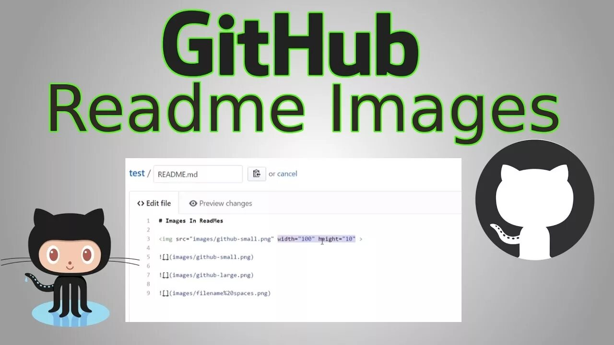

## [Создаем меню сайта](#теперь-о-списках)

Первым , что нужно сделать определится с пунктами [меню](a). Возможно выбрать значки.  
 Значки Вы можете найти на сайте [Фонт Авесоме](https://fontawesome.ru/)

> В интернете найдется много других значков, если поискать

В одном из разделов в _таблице_ приведены данные о посещаемости сайта.

| Пользователи 1 | Пользователь2 | Пользователь3 |
| :------------- | :-----------: | ------------: |
| Computer       |     1600      |             3 |
| Phone          |      12       |             2 |
| Pipe           |       1       |             1 |

### Подитожим

Вообщем **ничего сложного**.  
`a+b              
c+d`  
`j+v`

#### Теперь о списках

1. Нумерованный, может иметь подпункты:  
   -Первый  
   -Второй  
   -Третий
